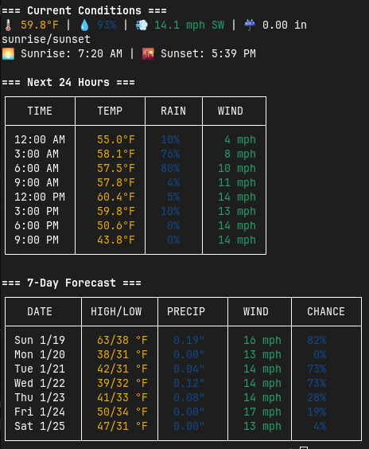

# go-weather

A command-line weather application built in Go that provides current weather conditions for any location using coordinates.



## Features

- Get weather information using latitude and longitude coordinates
- Support for multiple temperature units (Celsius, Fahrenheit)
- Support for multiple wind speed units (km/h, mph, m/s)
- Configurable timezone display
- Defaults to New York City coordinates when no location is specified

## Installation

```bash
git clone https://github.com/compuficial/go-weather.git

cd go-weather

go build -o weather
```

## Usage

### Basic Usage

Run the command without any flags to get weather for the default location (New York):

```bash
./weather
```

### Advanced Usage

Specify location and units using flags:

```bash
./weather -lat 37.3223 -lon -122.0322 -temp fahrenheit -tz America/Los_Angeles
```

```bash
./weather -lat 51.5074 -lon -0.1278 -temp celsius -tz Europe/London
```

### Available Flags

| Flag    | Description                              | Default Value      |
|---------|------------------------------------------|-------------------|
| -lat    | Latitude coordinate                      | 40.7143 (NYC)     |
| -lon    | Longitude coordinate                     | -74.006 (NYC)     |
| -temp   | Temperature unit (celsius, fahrenheit)    | fahrenheit        |
| -tz     | Timezone (e.g., America/New_York)        | America/New_York  |
| -wind   | Wind speed unit (kmh, mph, ms)           | mph               |
| -h      | Show help message (shorthand)            | -                 |
| -help   | Show help message                        | -                 |

## Examples

1. Get weather for Silicon Valley (Cupertino) in Fahrenheit:

```bash
./weather -lat 37.3223 -lon -122.0322 -temp fahrenheit -tz America/Los_Angeles
```

2. Get weather for London in Celsius:

```bash
./weather -lat 51.5074 -lon -0.1278 -temp celsius -tz Europe/London
```

3. Get weather for default location (New York) with wind speed in km/h:

```bash
./weather -wind kmh
```
